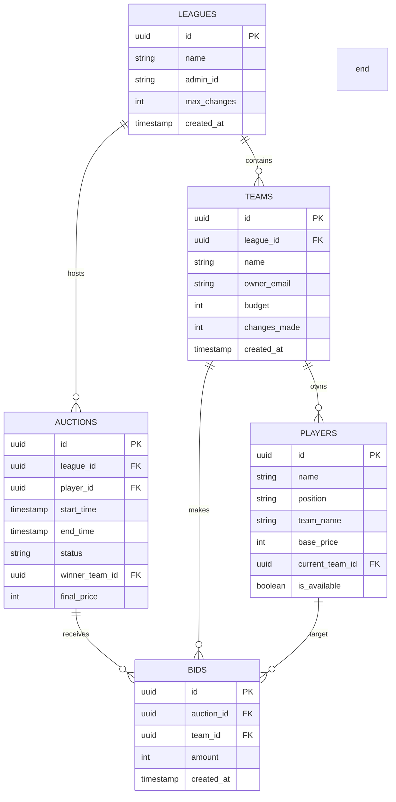

# Fantacalcio Auction Manager - Architettura Tecnica

## 1. Architettura di Sistema

```mermaid
graph TD
  A[Browser Utente] --> B[React Frontend Application]
  B --> C[Socket.io Client]
  B --> D[Supabase SDK]
  C --> E[Node.js Backend Server]
  E --> F[Socket.io Server]
  E --> G[Supabase Database]
  E --> H[Redis Cache]
  
  subgraph "Frontend Layer"
    B
    C
  end
  
  subgraph "Backend Layer"
    E
    F
    H
  end
  
  subgraph "Data Layer"
    G
  end
end
```

## 2. Descrizione Tecnologie

* Frontend: React\@18 + TypeScript + Tailwind CSS + Vite

* Backend: Node.js\@18 + Express\@4 + Socket.io\@4

* Database: Supabase (PostgreSQL)

* Cache: Redis (per gestione sessioni asta)

* File Storage: Supabase Storage (per upload CSV/Excel)

## 3. Definizioni Route

| Route                      | Scopo                                    |
| -------------------------- | ---------------------------------------- |
| /                          | Dashboard principale con panoramica lega |
| /login                     | Pagina di autenticazione utenti          |
| /league/:id                | Gestione specifica lega                  |
| /league/:id/teams          | Visualizzazione e gestione rose squadre  |
| /league/:id/players        | Gestione lista svincolati                |
| /league/:id/auction/config | Configurazione parametri asta            |
| /league/:id/auction/live   | Sala asta in tempo reale                 |
| /league/:id/history        | Storico aste completate                  |

## 4. Definizioni API

### 4.1 API Core

**Autenticazione utenti**

```
POST /api/auth/login
```

Request:

| Nome Parametro | Tipo   | Obbligatorio | Descrizione     |
| -------------- | ------ | ------------ | --------------- |
| email          | string | true         | Email utente    |
| password       | string | true         | Password utente |

Response:

| Nome Parametro | Tipo    | Descrizione                  |
| -------------- | ------- | ---------------------------- |
| success        | boolean | Stato della risposta         |
| token          | string  | JWT token per autenticazione |
| user           | object  | Dati utente                  |

**Gestione Leghe**

```
POST /api/leagues
GET /api/leagues/:id
PUT /api/leagues/:id
```

**Upload File Rose**

```
POST /api/leagues/:id/teams/upload
```

Request:

| Nome Parametro | Tipo | Obbligatorio | Descrizione                     |
| -------------- | ---- | ------------ | ------------------------------- |
| file           | File | true         | File CSV/Excel con rose squadre |

Response:

| Nome Parametro | Tipo    | Descrizione            |
| -------------- | ------- | ---------------------- |
| success        | boolean | Stato upload           |
| teams          | array   | Lista squadre caricate |

**Gestione Aste Real-time (Socket.io)**

```
// Eventi Socket
auction:join - Partecipazione all'asta
auction:bid - Nuovo rilancio
auction:timer - Aggiornamento timer
auction:end - Fine asta giocatore
```

Esempio evento rilancio:

```json
{
  "playerId": "123",
  "teamId": "456",
  "amount": 15000,
  "timestamp": "2024-01-15T10:30:00Z"
}
```

## 5. Architettura Server

```mermaid
graph TD
  A[Client Request] --> B[Express Router]
  B --> C[Authentication Middleware]
  C --> D[Controller Layer]
  D --> E[Service Layer]
  E --> F[Repository Layer]
  F --> G[(Supabase Database)]
  
  H[Socket.io Events] --> I[Socket Handler]
  I --> E
  E --> J[Redis Cache]
  
  subgraph Server
    B
    C
    D
    E
    F
    I
  end
end
```

## 6. Modello Dati

### 6.1 Definizione Modello Dati



### 6.2 Data Definition Language

**Tabella Leghe (leagues)**

```sql
-- Creazione tabella
CREATE TABLE leagues (
    id UUID PRIMARY KEY DEFAULT gen_random_uuid(),
    name VARCHAR(100) NOT NULL,
    admin_id UUID NOT NULL,
    max_changes INTEGER DEFAULT 3,
    auction_start_time TIMESTAMP WITH TIME ZONE,
    created_at TIMESTAMP WITH TIME ZONE DEFAULT NOW(),
    updated_at TIMESTAMP WITH TIME ZONE DEFAULT NOW()
);

-- Creazione indici
CREATE INDEX idx_leagues_admin_id ON leagues(admin_id);
CREATE INDEX idx_leagues_created_at ON leagues(created_at DESC);
```

**Tabella Squadre (teams)**

```sql
-- Creazione tabella
CREATE TABLE teams (
    id UUID PRIMARY KEY DEFAULT gen_random_uuid(),
    league_id UUID NOT NULL,
    name VARCHAR(100) NOT NULL,
    owner_email VARCHAR(255) NOT NULL,
    budget INTEGER DEFAULT 500,
    changes_made INTEGER DEFAULT 0,
    created_at TIMESTAMP WITH TIME ZONE DEFAULT NOW()
);

-- Creazione indici
CREATE INDEX idx_teams_league_id ON teams(league_id);
CREATE INDEX idx_teams_owner_email ON teams(owner_email);
```

**Tabella Giocatori (players)**

```sql
-- Creazione tabella
CREATE TABLE players (
    id UUID PRIMARY KEY DEFAULT gen_random_uuid(),
    name VARCHAR(100) NOT NULL,
    position VARCHAR(20) NOT NULL,
    team_name VARCHAR(100),
    base_price INTEGER DEFAULT 1,
    current_team_id UUID,
    is_available BOOLEAN DEFAULT true,
    league_id UUID NOT NULL,
    created_at TIMESTAMP WITH TIME ZONE DEFAULT NOW()
);

-- Creazione indici
CREATE INDEX idx_players_league_id ON players(league_id);
CREATE INDEX idx_players_position ON players(position);
CREATE INDEX idx_players_available ON players(is_available);
```

**Tabella Aste (auctions)**

```sql
-- Creazione tabella
CREATE TABLE auctions (
    id UUID PRIMARY KEY DEFAULT gen_random_uuid(),
    league_id UUID NOT NULL,
    player_id UUID NOT NULL,
    start_time TIMESTAMP WITH TIME ZONE DEFAULT NOW(),
    end_time TIMESTAMP WITH TIME ZONE,
    status VARCHAR(20) DEFAULT 'active' CHECK (status IN ('active', 'completed', 'cancelled')),
    winner_team_id UUID,
    final_price INTEGER,
    created_at TIMESTAMP WITH TIME ZONE DEFAULT NOW()
);

-- Creazione indici
CREATE INDEX idx_auctions_league_id ON auctions(league_id);
CREATE INDEX idx_auctions_status ON auctions(status);
CREATE INDEX idx_auctions_start_time ON auctions(start_time DESC);
```

**Tabella Rilanci (bids)**

```sql
-- Creazione tabella
CREATE TABLE bids (
    id UUID PRIMARY KEY DEFAULT gen_random_uuid(),
    auction_id UUID NOT NULL,
    team_id UUID NOT NULL,
    amount INTEGER NOT NULL,
    created_at TIMESTAMP WITH TIME ZONE DEFAULT NOW()
);

-- Creazione indici
CREATE INDEX idx_bids_auction_id ON bids(auction_id);
CREATE INDEX idx_bids_team_id ON bids(team_id);
CREATE INDEX idx_bids_created_at ON bids(created_at DESC);

-- Dati iniziali
INSERT INTO leagues (name, admin_id, max_changes) VALUES 
('Lega Esempio', gen_random_uuid(), 5);
```

**Permessi Supabase**

```sql
-- Permessi base per ruolo anonimo
GRANT SELECT ON leagues TO anon;
GRANT SELECT ON teams TO anon;
GRANT SELECT ON players TO anon;

-- Permessi completi per utenti autenticati
GRANT ALL PRIVILEGES ON leagues TO authenticated;
GRANT ALL PRIVILEGES ON teams TO authenticated;
GRANT ALL PRIVILEGES ON players TO authenticated;
GRANT ALL PRIVILEGES ON auctions TO authenticated;
GRANT ALL PRIVILEGES ON bids TO authenticated;
```

