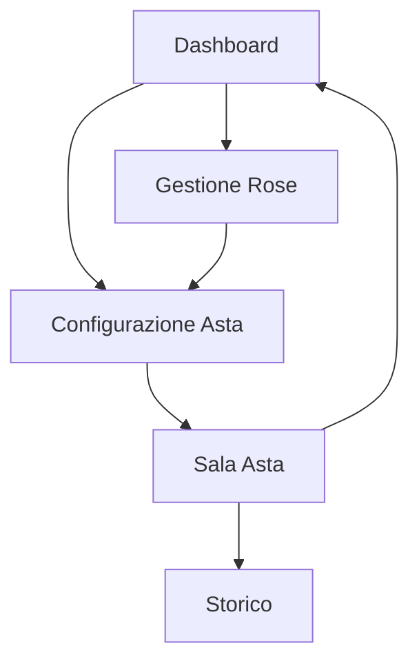

# Fantacalcio Auction Manager - Documento dei Requisiti di Prodotto

## 1. Panoramica del Prodotto
Un'applicazione web per la gestione delle aste del fantacalcio che permette di organizzare e condurre aste in tempo reale con funzionalità avanzate di gestione squadre e giocatori.

L'app risolve il problema della gestione manuale delle aste fantacalcio, automatizzando i processi di rilancio, gestione tempi e tracciamento delle rose delle squadre.

Target: Leghe di fantacalcio che vogliono digitalizzare e migliorare l'esperienza delle aste.

## 2. Funzionalità Principali

### 2.1 Ruoli Utente
| Ruolo | Metodo di Registrazione | Permessi Principali |
|-------|------------------------|---------------------|
| Amministratore Lega | Creazione lega | Gestione completa aste, configurazioni, caricamento file |
| Partecipante | Invito/codice lega | Partecipazione aste, visualizzazione rosa propria |

### 2.2 Moduli Funzionali
La nostra applicazione per aste fantacalcio è composta dalle seguenti pagine principali:
1. **Dashboard**: panoramica lega, stato aste, navigazione principale.
2. **Gestione Rose**: caricamento e visualizzazione rose squadre, gestione svincolati.
3. **Configurazione Asta**: impostazione parametri asta, numero cambi massimi, orari.
4. **Sala Asta**: interfaccia asta in tempo reale, sistema rilanci, timer automatico.
5. **Storico**: visualizzazione aste completate, statistiche, export dati.

### 2.3 Dettagli Pagine
| Nome Pagina | Nome Modulo | Descrizione Funzionalità |
|-------------|-------------|-------------------------|
| Dashboard | Panoramica Lega | Visualizza stato attuale lega, prossime aste, statistiche generali |
| Dashboard | Menu Navigazione | Accesso rapido a tutte le sezioni principali dell'app |
| Gestione Rose | Caricamento Rose | Upload file CSV/Excel con rose attuali delle squadre |
| Gestione Rose | Lista Svincolati | Upload e gestione file giocatori disponibili per l'asta |
| Gestione Rose | Visualizzazione Rose | Mostra composizione attuale di ogni squadra della lega |
| Configurazione Asta | Parametri Asta | Imposta numero massimo cambi per squadra, budget disponibile |
| Configurazione Asta | Gestione Orari | Definisce ora inizio asta, durata slot per giocatore |
| Configurazione Asta | Regole Rilancio | Configura sistema di estensione automatica tempo in caso di rilanci |
| Sala Asta | Interfaccia Rilanci | Sistema real-time per effettuare e visualizzare rilanci |
| Sala Asta | Timer Dinamico | Countdown automatico con estensione se rilancio nell'ultimo minuto |
| Sala Asta | Stato Partecipanti | Visualizza budget rimanente e cambi effettuati per ogni squadra |
| Storico | Aste Completate | Archivio delle aste precedenti con dettagli transazioni |
| Storico | Export Dati | Esportazione risultati in formati CSV/PDF |

## 3. Processo Principale

**Flusso Amministratore:**
1. Crea nuova lega e invita partecipanti
2. Carica file rose attuali e lista svincolati
3. Configura parametri asta (cambi massimi, orari, regole)
4. Avvia asta e modera il processo
5. Esporta risultati finali

**Flusso Partecipante:**
1. Accede alla lega tramite invito
2. Visualizza la propria rosa e lista svincolati
3. Partecipa all'asta effettuando rilanci
4. Monitora budget e cambi rimanenti
5. Visualizza risultati finali

## 4. Design dell'Interfaccia Utente

### 4.1 Stile di Design
- **Colori primari:** Verde calcio (#2E7D32), Bianco (#FFFFFF)
- **Colori secondari:** Grigio scuro (#424242), Arancione accento (#FF6F00)
- **Stile pulsanti:** Arrotondati con effetti hover, design moderno
- **Font:** Roboto per testi, dimensioni 14px-18px per contenuti, 24px+ per titoli
- **Layout:** Design a card con sidebar di navigazione, responsive mobile-first
- **Icone:** Material Design Icons per coerenza e riconoscibilità

### 4.2 Panoramica Design Pagine
| Nome Pagina | Nome Modulo | Elementi UI |
|-------------|-------------|-------------|
| Dashboard | Panoramica Lega | Card statistiche con colori verde/bianco, grafici circolari per budget, layout a griglia responsive |
| Gestione Rose | Caricamento Rose | Area drag-and-drop per file, tabelle responsive con ordinamento, indicatori di stato caricamento |
| Configurazione Asta | Parametri Asta | Form con input numerici, slider per valori, toggle switches per opzioni booleane |
| Sala Asta | Interfaccia Rilanci | Timer circolare prominente, lista rilanci in tempo reale, pulsanti azione grandi e colorati |
| Storico | Aste Completate | Timeline verticale, card espandibili per dettagli, filtri e ricerca avanzata |

### 4.3 Responsività
Design mobile-first con breakpoint a 768px e 1024px. Ottimizzazione touch per dispositivi mobili con pulsanti di dimensione minima 44px e gesture swipe per navigazione rapida.